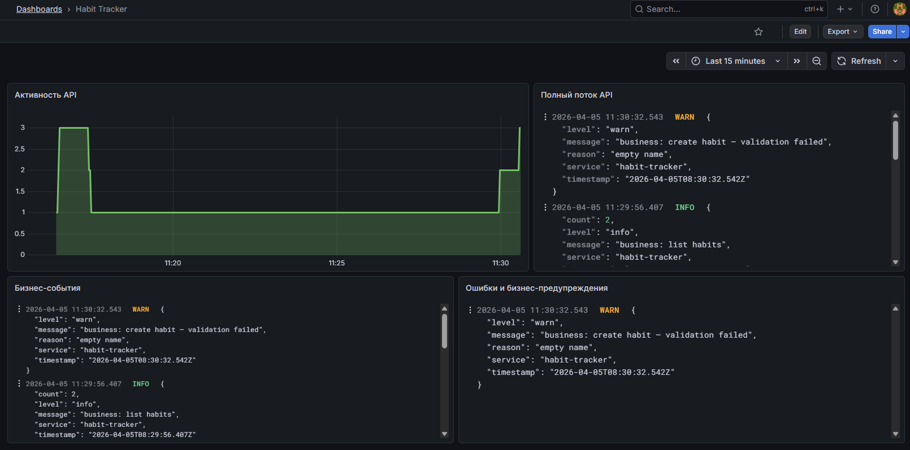
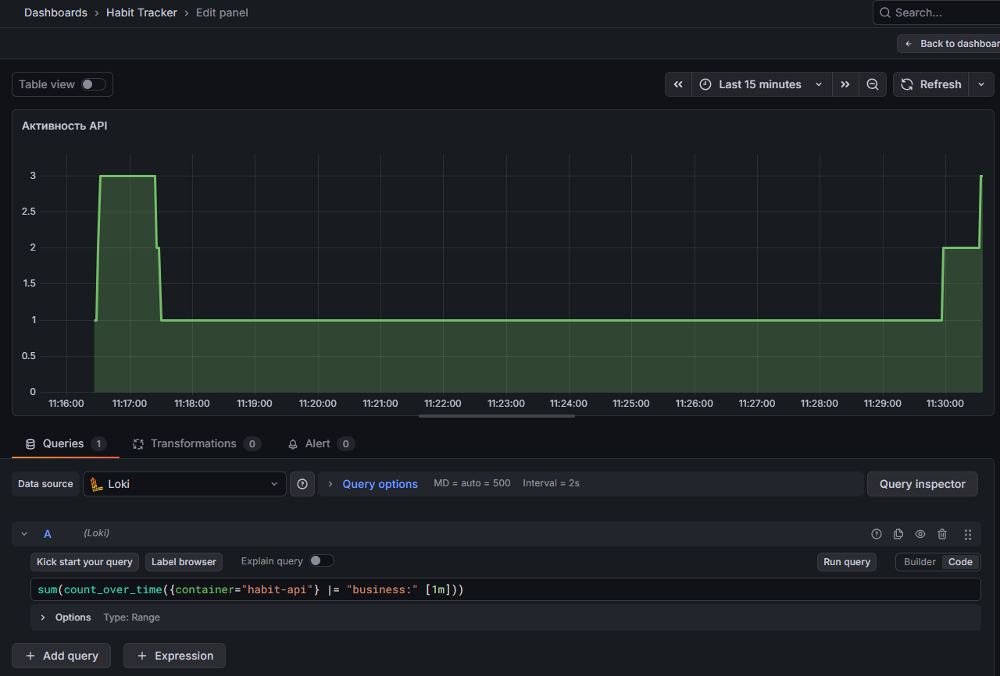
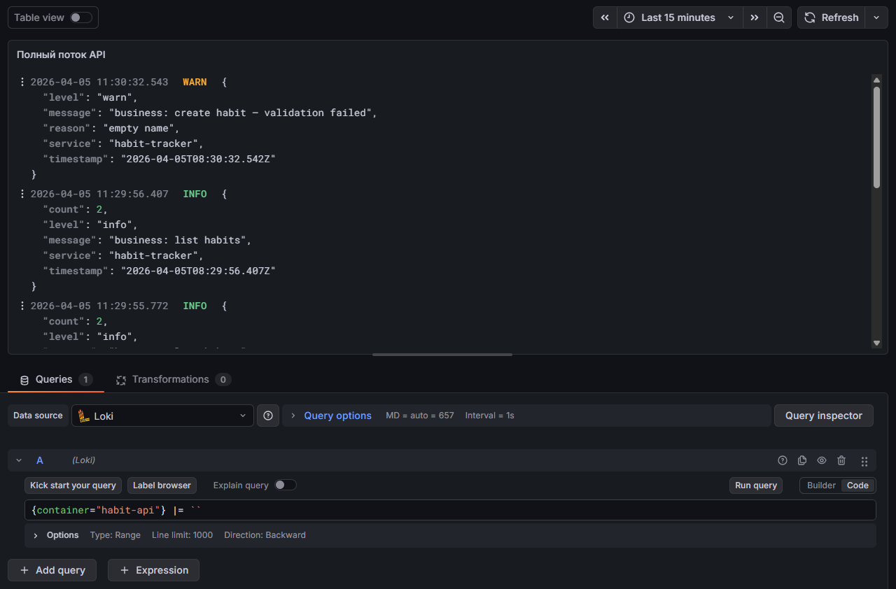
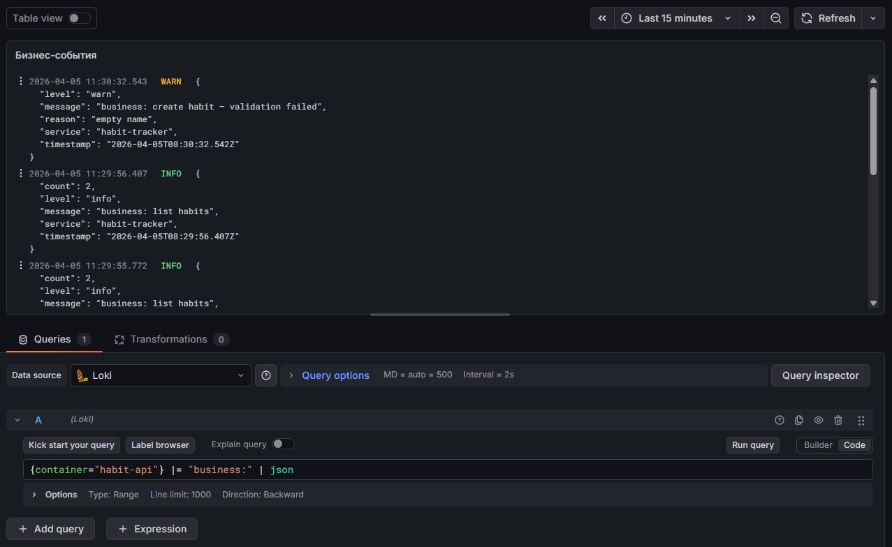
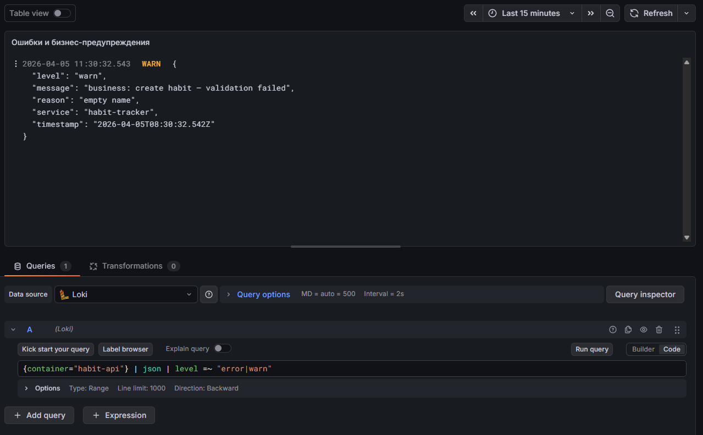

# Логи: Loki, Promtail, Grafana

← [Описание проекта и запуск API (README)](./README.md) · [Метрики (Prometheus, Grafana)](./METRICS.md) · [Трейсы, Tempo и Grafana](./TRACES.md)

Приложение пишет логи в **stdout** контейнера (**Winston**, JSON в production). **Docker** сохраняет поток контейнера; **Promtail** читает логи через `docker.sock` и отправляет их в **Loki**; **Grafana** подключается к Loki и на дашборде показывает запросы **LogQL** (текстовые панели **Logs** и график **Time series**).

## Что пишет приложение

- **`habit-api/logger.js`** - уровень `info`, формат JSON, мета `service: habit-tracker`.
- **`habit-api/services/DefaultService.js`** - бизнес-события с префиксом `business:` (список, создание, получение по id, удаление, валидация).
- Ошибки и предупреждения попадают в поле **`level`** (`error`, `warn`) в JSON.

Конфиг отправки логов: `promtail/promtail.yml` (push на `http://loki:3100/loki/api/v1/push`, метка `container` из имени контейнера).

Источник данных Loki в Grafana задаётся файлом `grafana/provisioning/datasources/loki.yml` (URL **`http://loki:3100`** внутри сети compose).

## Запросы LogQL на дашборде



**1. Активность API** (панель **Time series**):

```logql
sum(count_over_time({container="habit-api"} |= "business:" [1m]))
```



**2. Полный поток API** (панель **Logs**):

```logql
{container="habit-api"} |= ``
```



**3. Бизнес-события** (панель **Logs**):

```logql
{container="habit-api"} |= "business:" | json
```



**4. Ошибки и бизнес-предупреждения** (панель **Logs**):

```logql
{container="habit-api"} | json | level =~ "error|warn"
```



## Файлы в репозитории

- `docker-compose.yml` - сервисы `loki`, `promtail`, `grafana`, тома provisioning.
- `promtail/promtail.yml` - куда слать логи и как помечать `container`.
- `grafana/provisioning/datasources/loki.yml` - datasource **Loki** для Grafana.
- `habit-api/logger.js` - Winston и уровни логирования.
- `habit-api/services/DefaultService.js` - бизнес-логи `business:`.
