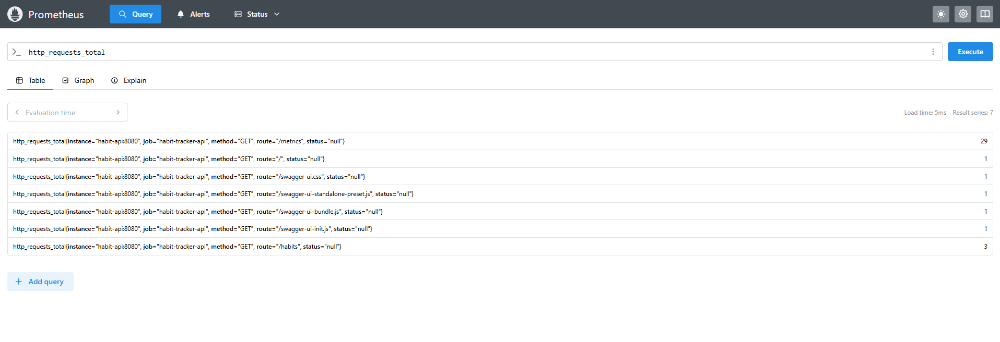
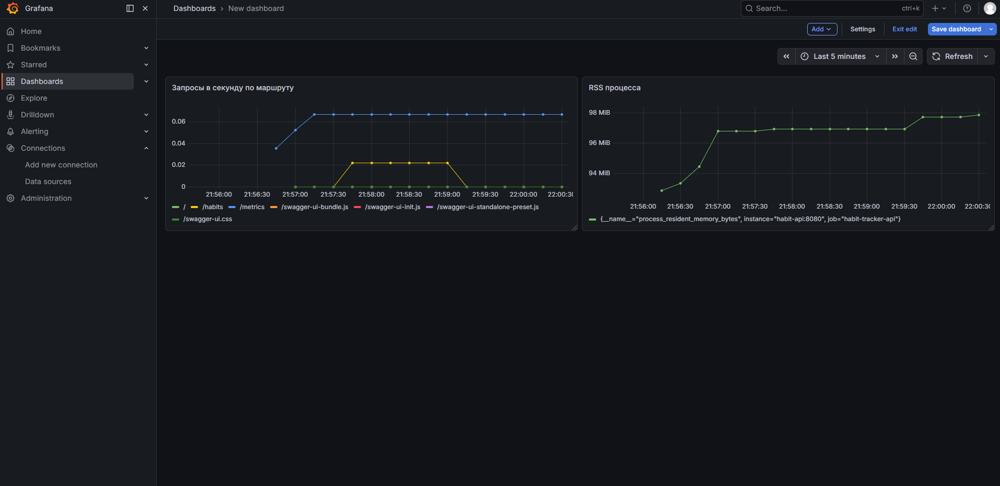

# Метрики: Prometheus, Grafana

API отдаёт метрики в формате **Prometheus**; **Prometheus** по расписанию опрашивает эндпоинт `/metrics`; **Grafana** подключается к Prometheus как к источнику данных и строит графики.

## Что отдаёт приложение

- **`GET /metrics`** - выдача Prometheus.
- **`collectDefaultMetrics()`** - стандартные метрики процесса Node.js: память (в т.ч. RSS), CPU, event loop, GC и др. (имена с префиксами `process_`, `nodejs_`).
- **`http_requests_total`** - счётчик HTTP-запросов с метками `method`, `route`, `status` (код ответа - `res.statusCode`).

Проверка без Docker:

```bash
cd habit-api && npm install && npm start
curl -s http://localhost:8080/metrics
```

## Запуск стека (Docker Compose)

Из корня репозитория:

```bash
docker compose up -d
```

| Сервис       | Назначение           | Порт на хосте |
|--------------|----------------------|---------------|
| `habit-api`  | API и `/metrics`     | **8080**      |
| `prometheus` | Сбор метрик (scrape) | **9090**      |
| `grafana`    | Дашборды             | **3001**      |

Конфиг scrape: `prometheus/prometheus.yml` - job `habit-tracker-api`, target **`habit-api:8080`**, путь по умолчанию `/metrics`, интервал `scrape_interval: 15s`.

Цель должна быть доступна: **http://localhost:9090** → **Status → Targets** → состояние **UP**.

## Подключение Grafana к Prometheus

1. **http://localhost:3001** (логин по умолчанию `admin` / `admin`)
2. **Connections → Data sources → Prometheus** - URL **`http://prometheus:9090`**
3. **Save & test**, затем создайте дашборд

## Примеры запросов (PromQL)

- Запросы в секунду по маршруту:

  ```promql
  sum by (route) (rate(http_requests_total[1m]))
  ```

- RSS процесса (метрика по умолчанию):

  ```promql
  process_resident_memory_bytes
  ```

После обращений к API или к Swagger UI (**http://localhost:8080/api-docs**) счётчики и графики `rate(...)` начинают отражать трафик.

## Скриншоты Prometheus и Grafana

Ниже - веб-интерфейс Prometheus (**http://localhost:9090**): в поле запроса введён **`http_requests_total`**.



Дашборд в Grafana (**http://localhost:3001**) - две панели. **Первая** строится по запросу `sum by (route) (rate(http_requests_total[1m]))` - скорость запросов в секунду, разбитая по маршрутам. **Вторая** - `process_resident_memory_bytes`: резидентная память (RSS) процесса Node.js в байтах (в настройках панели задан unit **bytes (IEC)**).



## Файлы в репозитории

- `docker-compose.yml` - сервисы API, Prometheus, Grafana.
- `prometheus/prometheus.yml` - targets и интервал scrape.
- `habit-api/expressServer.js` - метрики и маршрут `/metrics`.

Описание самого API см. [README.md](./README.md).

