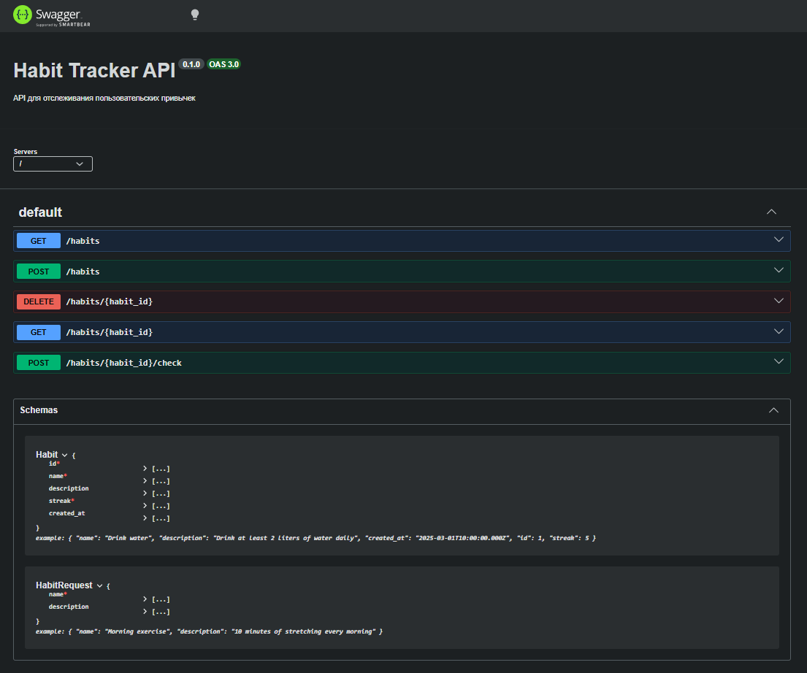
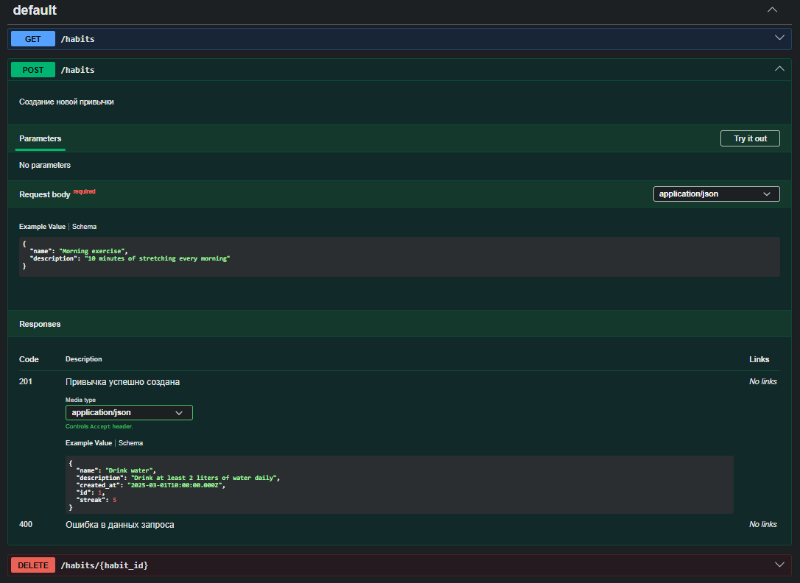

# Habit Tracker API (API First с OpenAPI)

REST API для отслеживания привычек, выполненный по подходу **API First** с использованием спецификации **OpenAPI 3.0**.

См. также: [метрики, Prometheus и Grafana](./METRICS.md), [логи, Loki и Grafana](./LOGS.md).

## О проекте

**Habit Tracker API** - сервис для учёта личных привычек. Позволяет создавать привычки (название и описание), просматривать список, удалять и отмечать выполнение за день. У каждой привычки хранится счётчик серии дней подряд (**streak**). 

## Описание работы (API First)

Выполнено по методологии **API First**:

1. **Контракт API** — в корне проекта описан `openapi.yaml`: эндпоинты (`/habits`, `/habits/{id}`, `/habits/{id}/check`), методы, схемы `Habit` и `HabitRequest`. Спецификация служит единым источником правды для клиента и сервера.
2. **Генерация сервера** — из `openapi.yaml` с помощью **OpenAPI Generator** (генератор `nodejs-express-server`) получен каркас приложения на Node.js и Express в папке `habit-api/`.
3. **Реализация логики** — в `habit-api/services/DefaultService.js` добавлена бизнес-логика: массив привычек в памяти, автоинкремент ID при создании, обновление streak при вызове «отметить выполнение», ответы 404 при отсутствии привычки и 400 при пустом имени.
4. **Документация и тестирование** — по той же спецификации сервер поднимает **Swagger UI** (`/api-docs`), где можно просматривать API и вызывать эндпоинты из браузера без отдельного клиента.

В итоге один файл OpenAPI задаёт и форму запросов/ответов, и скелет сервера, и интерактивную документацию.

## Используемые технологии

- [OpenAPI 3.0](https://swagger.io/specification/) — спецификация API
- [OpenAPI Generator](https://openapi-generator.tech/) — генерация Node.js Express сервера
- Node.js, [Express](https://expressjs.com/)
- [Swagger UI](https://swagger.io/tools/swagger-ui/) — интерактивная документация (встроена в сервер)

## Установка и запуск

### Требования

- Node.js 18+
- npm
- (Для генерации кода заново) Java 8+ или Docker

### Запуск готового сервера

1. **Клонировать репозиторий**

   ```bash
   git clone <url-репозитория>
   cd habit-tracker-api-openapi
   ```

2. **Установить зависимости и запустить API**

   ```bash
   cd habit-api
   npm install
   npm start
   ```

   Сервер будет доступен по адресу **http://localhost:8080**.

3. **Открыть Swagger UI**

   В браузере: **http://localhost:8080/api-docs** — просмотр и тестирование всех эндпоинтов.

   Спецификация в формате YAML: **http://localhost:8080/openapi**.

### Генерация сервера из OpenAPI (если нужно перегенерировать)

Из корня проекта:

```bash
# Через OpenAPI Generator CLI (который нужно установить, если его нет)
openapi-generator-cli generate -i openapi.yaml -g nodejs-express-server -o habit-api --additional-properties serverPort=8080
```

## Эндпоинты API

| Метод | Путь | Описание |
|-------|------|----------|
| GET | `/habits` | Список всех привычек |
| POST | `/habits` | Создать привычку (тело: `name`, опционально `description`) |
| GET | `/habits/{habit_id}` | Получить привычку по ID |
| DELETE | `/habits/{habit_id}` | Удалить привычку |
| POST | `/habits/{habit_id}/check` | Отметить выполнение (увеличивает streak) |

## Скриншоты Swagger UI

Ниже - документация API в Swagger UI (http://localhost:8080/api-docs).



Создание новой привычки:


