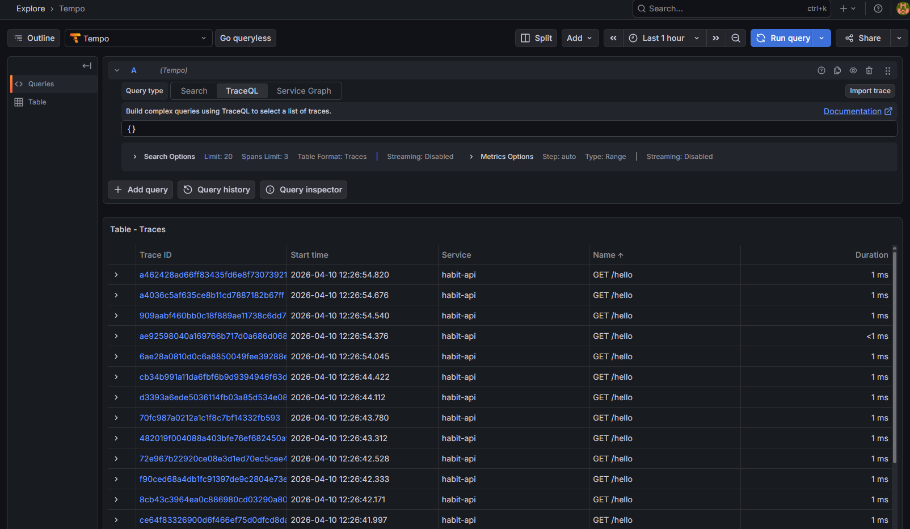
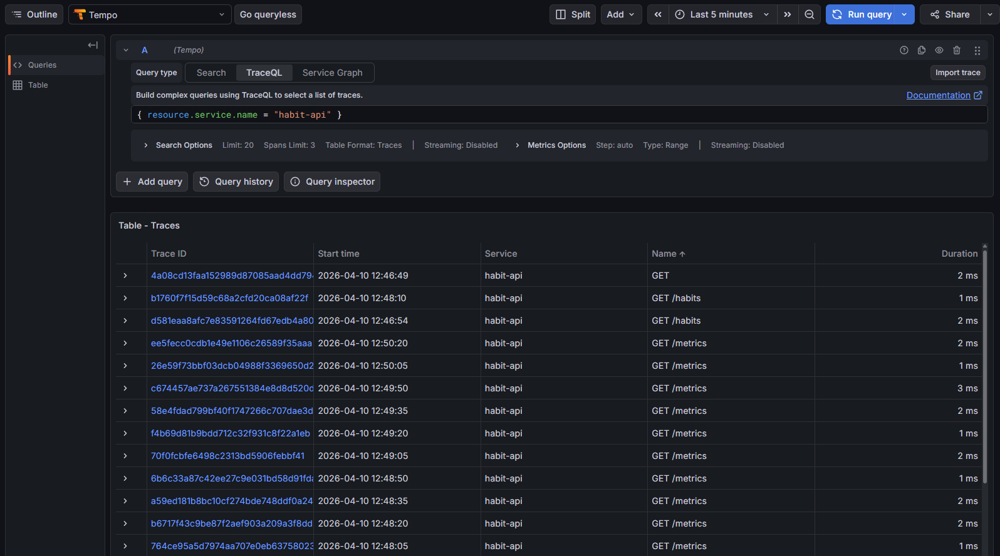
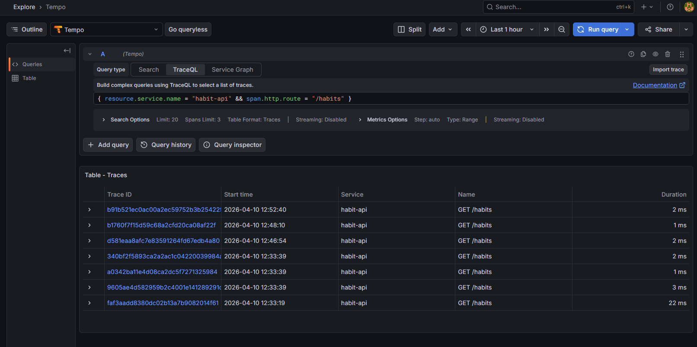
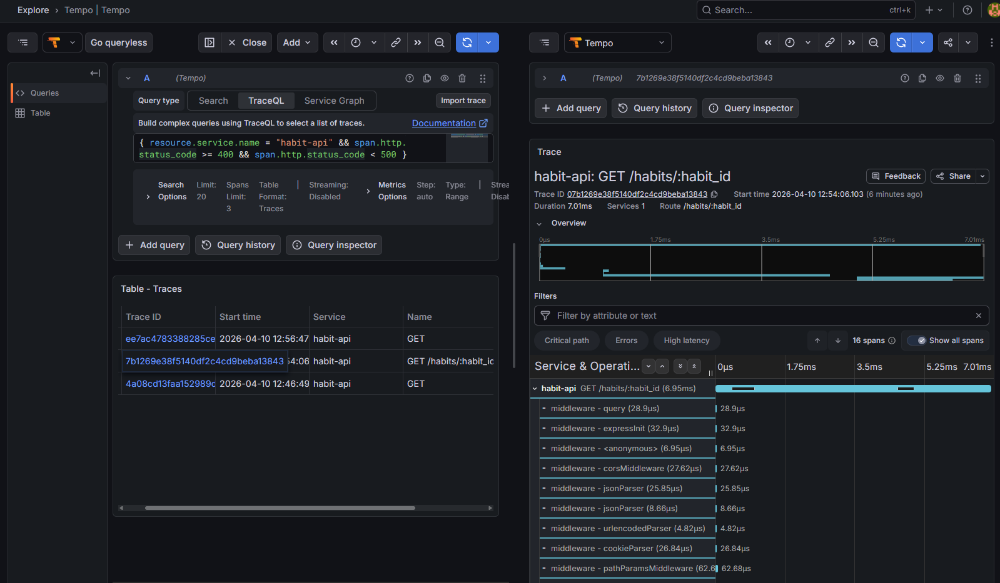

# Трейсы: Tempo, Grafana (OTLP)

← [Описание проекта и запуск API (README)](./README.md) · [Метрики (Prometheus, Grafana)](./METRICS.md) · [Логи (Loki, Promtail, Grafana)](./LOGS.md)

Приложение генерирует **трейсы** (spans) через **OpenTelemetry**. Экспорт происходит по протоколу **OTLP** в **Tempo**; затем **Grafana** подключается к Tempo как datasource и позволяет искать/просматривать трейсы, а также выполнять запросы на языке **TraceQL**.

## 1) Экспорт трейсов из приложения (habit-api)

Файл: `habit-api/tracing.js`.

- Экспортёр: `@opentelemetry/exporter-trace-otlp-http`
- Формат: **OTLP over HTTP**
- Эндпоинт задаётся переменной окружения **`OTEL_EXPORTER_OTLP_TRACES_ENDPOINT`**
  - при локальном запуске: `http://localhost:4318/v1/traces`
  - при запуске в Docker: `http://tempo:4318/v1/traces` (внутри сети compose)

Важно: **`tempo` - это имя сервиса в Docker-сети**. Если `habit-api` запущен локально (не в контейнере), то `http://tempo:...` работать не будет - нужен `localhost`.

## 2) Запуск Tempo + Grafana (Docker Compose)

Из корня репозитория:

```bash
docker compose up -d
```

| Сервис    | Назначение                       | Порт на хосте |
|-----------|----------------------------------|---------------|
| `tempo`   | приём/хранение трейсов + search  | **3200**, **4318** |
| `grafana` | просмотр/поиск трейсов (UI)      | **3010**      |

## 3) Генерация трейсов (создать нагрузку)

Трейсы появляются только после запросов к API. Самый простой способ:

```bash
curl http://localhost:8080/hello
curl http://localhost:8080/habits
```

## 5) Просмотр трейсов в Grafana (Tempo datasource)

1. Откройте Grafana: **http://localhost:3010** (по умолчанию `admin` / `admin`)
2. **Explore** → выберите datasource **Tempo**
3. Выставьте период: **Last 15 minutes**
4. Выполните поиск (см. примеры ниже)
5. Откройте найденный trace - увидите waterfall/таймлайн спанов и атрибуты (http.route, status, latency и т.д.)

Источник данных Tempo в Grafana provision’ится файлом `grafana/provisioning/datasources/tempo.yml` (URL **`http://tempo:3200`** внутри сети compose).

## Примеры запросов (TraceQL)

**1. Все трейсы**:

```traceql
{}
```



**2. Только сервис habit-api**:

```traceql
{ resource.service.name = "habit-api" }
```



**3. Трейсы по маршруту**:

```traceql
{ resource.service.name = "habit-api" && span.http.route = "/habits" }
```



**4. Трейсы с ошибками**:

Найдем клиентские ошибки:

```traceql
{ resource.service.name = "habit-api" && span.http.status_code >= 400 && span.http.status_code < 500 }
```



## Файлы в репозитории

- `docker-compose.yml` - сервисы `tempo`, `grafana`, сеть, переменные окружения `habit-api` для OTLP endpoint.
- `tempo/tempo.yml` - включение OTLP receiver’ов и binding на `0.0.0.0:4318` / `0.0.0.0:4317`.
- `grafana/provisioning/datasources/tempo.yml` - datasource Tempo для Grafana.
- `habit-api/tracing.js` - инициализация OpenTelemetry SDK и экспорт трейсов.

